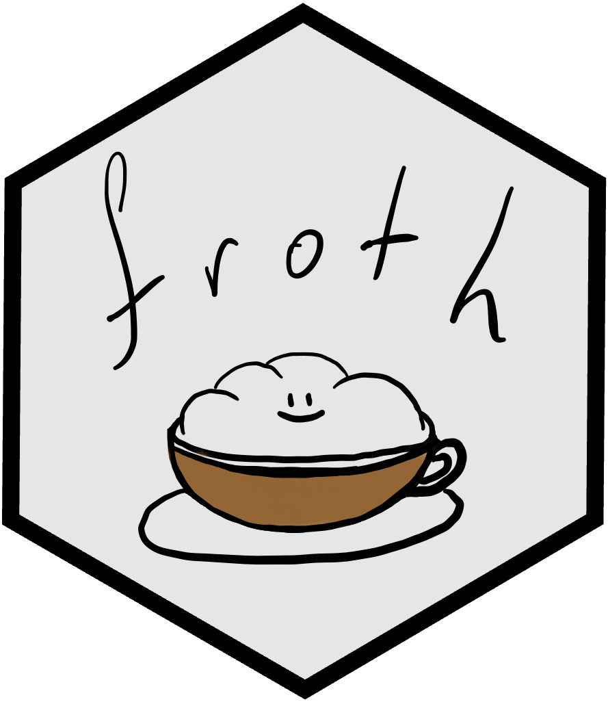

# froth: FORTH for R

froth is a FORTH implementation for R (or at least, it will be).
This implementation comes with a number of differences from other FORTHs:
- uses R operators for arithmetic, so `x y z */` and `x y z * /` produce the same result
- arbitrary R objects can be pushed onto the stack
- built-in R `print` methods; use `.R` to format according to the print method for the top of the parameter stack
- TRUE/FALSE are evaluated R-like rather than FORTH-like (-1 is FALSE, 1 is TRUE, 'A' is FALSE)
- obfuscated memory (no direct or emulated hardware-level memory access)
- no distinction between compiled and interpreted words (loops are possible outside of definitions!)
- Use of R lists for internal arrays; arrays of bytes are not supported

I've just started development, but this README will be updated as I get further in this project.
So far I'm maybe 1/3rd of the way to a working first version. This will (likely) not be a 1:1 copy
of Gforth, I think I'd rather have a forth implementation that is robust and works in R than one
that exacly imitates existing Gforth. But...tbd.

Implementation proceeds in the order that words are introduced in [the FORTH tutorial](https://www.forth.com/starting-forth/).
So far I have implemented everything up to chapter 5, with a few exceptions mentioned below.

## TODOs after finishing implementing the tutorial
- FORGET word (will save this for last, definitions will currently overwrite previous ones)
- any kind of I/O functionality; will support loading words from files later
- support for evaluating R and pushing the result onto the stack
